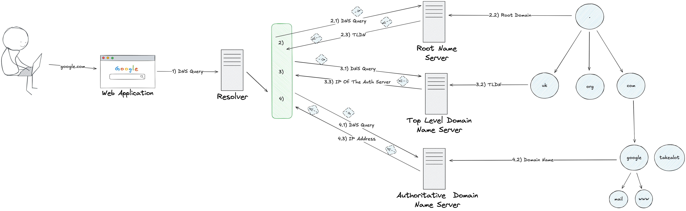
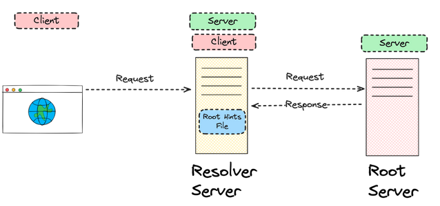
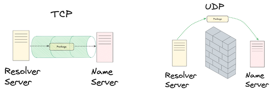
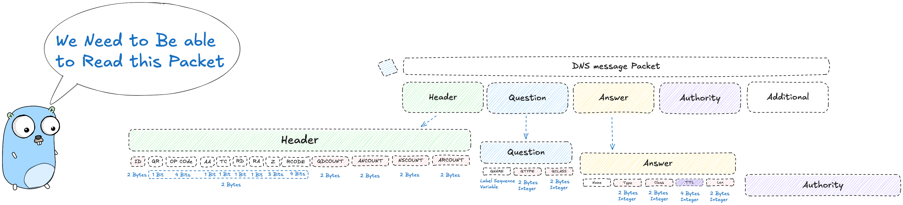

# DNS - Domain Name System 
****
The Domain Name System (DNS) is a hierarchical and decentralized naming system for computers, services, or other resources connected to the Internet or a private network. It translates more readily memorized domain names to the numerical IP addresses needed for locating and identifying computer services and devices with the underlying network protocols. By providing a worldwide, distributed directory service, the Domain Name System is an essential component of the functionality of the Internet.

**Step 1**: The user sends a DNS Query to the DNS Resolver (Usually provided by the ISP) to resolve a domain name (e.g., www.google.com) into an IP address.( What is the IP address of www.google.com ?)

**Step 2.1**: The DNS Resolver checks its cache to see if it has the IP address for the requested domain name. If it does, it returns the IP address to the user. If not, it proceeds to the next step.If the DNS Resolver does not have the IP address in its cache, it sends a query to a Root Name Server to find out which Top-Level Domain (TLD) Name Server is responsible for the domain (e.g., .uk, .org, .com).

**Step 2.2 - 2.3**: The Root Name Server responds with the IP address of the appropriate TLD Name Server.

**Step 3.1**: The DNS Resolver then sends a query to the **TLD Name Server** to find out which **Authoritative Name Server** is responsible for the specific domain (e.g., google.com).

**Step 3.2 - 3.3**: The TLD Name Server responds with the IP address of the **Authoritative Name Server** for the requested domain.

**Step 4.1**: The DNS Resolver sends a query to the **Authoritative Name Server** to get the IP address for the specific domain name (e.g., www.google.com).

**Step 4.2 - 4.3**: The **Authoritative Name Server** responds with the IP address for the requested domain name.

## Queries

Simply put a query is just a message that is sent to a Name server  to get a response.   
These responses are either: 

* An **answer** to the Query   
* An **referral** to another set of name servers   
* An **error** response saying something went wrong.

Users don’t directly create DNS queries themselves. Instead, they communicate with the Resolver, which takes care of sending the queries and handling the responses on their behalf.
    
****

When the Resolver exchanges these messages with other DNS servers, it relies on the underlying network transport layer. Depending on the situation, these messages can travel over **UDP (User Datagram Protocol)** which is faster and typically used for most DNS lookups or **TCP (Transmission Control Protocol)**, which is used when reliability or larger message sizes are required.

****

Now that we understand the way that the messages are delivered let's have a deeper look into what the messages look like. The message format for a **Query** and a **Response** is the same. It is a message that contains a Header with 4 main sections. Each section has a different purpose and contains different sets of information that the resolver or name server needs to process the query successfully.

Now one of the most important concepts to understand about the message is how the message is structured.

#### Package Structure
****

| Section  | Size | Type | Purpose |
| ----- | ----- | ----- | ----- |
| **Header Section** | 12 Bytes | Header | Provides info about the Query or Response |
| **Question Section** | Variable | List of Questions | Carries the **query** **name** and **other** **query** **parameters** |
| **Answer Section** | Variable | List of Records | This carries the **RR** that answers the query |
| **Authority Section** | Variable | List of Records | This carries a list of Nameservers (NS Records) that is used to resolve the queries. |
| **Additional Section** | Variable | List of Records | These are additional Records that might be useful. |

****
The DNS Message is represented as a series fo Bytes. This is due to a porcess called serialization and ddesiralization, comonly refered to as marchaling and demarshaling. This is the process of converting a data structure or object into a format that can be easily stored or transmitted and then reconstructing it back into its original form. Thus the DNS messages are serialized into a byte stream for transmission over the network and then deserialized back into a structured format upon receipt. For more Detail have a look at this exy packet parser:[Parse DNS Message](./dns/dns_buf/README.md)