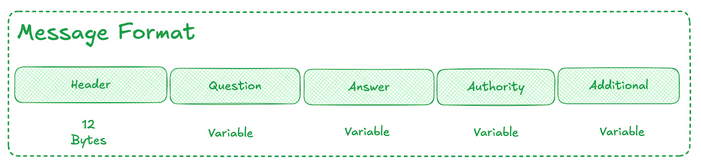
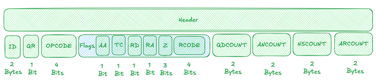

## Queries

Simply put a query is just a message that is sent to a Name server  to get a response.   
These responses are either: 

* An **answer** to the Query   
* An **referral** to another set of name servers   
* An **error** response saying something went wrong.

Users don’t create these queries but they interact with the Resolver instead , meaning that the resolver handles **Queries** and **Responses** on the users half. 

****

The network layer that is being used for these messages can be **UDP (User Datagram Protocol)** or **TCP (Transmission Control Protocol)**

****

The message format for a **Query** and a **Response** is the same; it is a message that contains a Header with 4 main sections. 

The most important **field** in the **header** is a **four** **bit** **field** called the **opcode** which is how **different queries are separated.**

****

| Section  | Size | Type | Purpose |
| ----- | ----- | ----- | ----- |
| **Header Section** | 12 Bytes | Header | Provides info about the Query or Response |
| **Question Section** | Variable | List of Questions | Carries the **query** **name** and **other** **query** **parameters** |
| **Answer Section** | Variable | List of Records | This carries the **RR** that answers the query |
| **Authority Section** | Variable | List of Records | This carries a list of Nameservers (NS Records) that is used to resolve the queries. |
| **Additional Section** | Variable | List of Records | These are additional Records that might be useful. |

#### Headers

****

| RFC Name | Descriptive Name | Length | Description |
| ----- | ----- | ----- | ----- |
| ID | Packet Identifier | 16 bits ( 2 Bytes) | A random identifier is assigned to query packets. Response packets must reply with the same id. This is needed to differentiate responses due to the stateless nature of UDP. |
| QR | Query Response | 1 bit | 0 for queries, 1 for responses. |
| OPCODE | Operation Code | 4 bits | **Typically always 0**, see RFC1035 for details. |
| Flag :AA | Authoritative Answer | 1 bit | Set to 1 if the responding server is authoritative \- that is, it "owns" \- the domain queried. |
| Flag :TC | Truncated Message | 1 bit | Set to 1 if the message length exceeds 512 bytes. Traditionally a hint that the query can be reissued using TCP, for which the length limitation doesn't apply. |
| Flag :RD | Recursion Desired | 1 bit | Set by the sender of the request if the server should attempt to resolve the query recursively if it does not have an answer readily available. |
| Flag :RA | Recursion Available | 1 bit | Set by the server to indicate whether or not recursive queries are allowed. |
| Flag :Z | Reserved | 3 bits | Originally reserved for later use, but now used for DNSSEC queries. |
| Flag :RCODE | Response Code | 4 bits | Set by the server to indicate the status of the response, i.e. whether or not it was successful or failed, and in the latter case providing details about the cause of the failure. |
| QDCOUNT | Question Count | 16 bits | The number of entries in the Question Section |
| ANCOUNT | Answer Count | 16 bits | The number of entries in the Answer Section |
| NSCOUNT | Authority Count | 16 bits | The number of entries in the Authority Section |
| ARCOUNT | Additional Count | 16 bits | The number of entries in the Additional Section |

